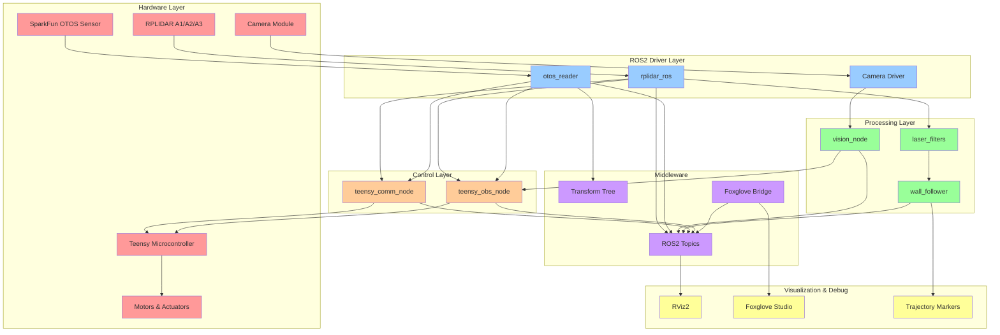
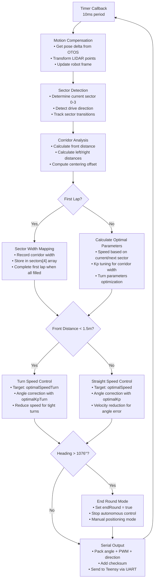
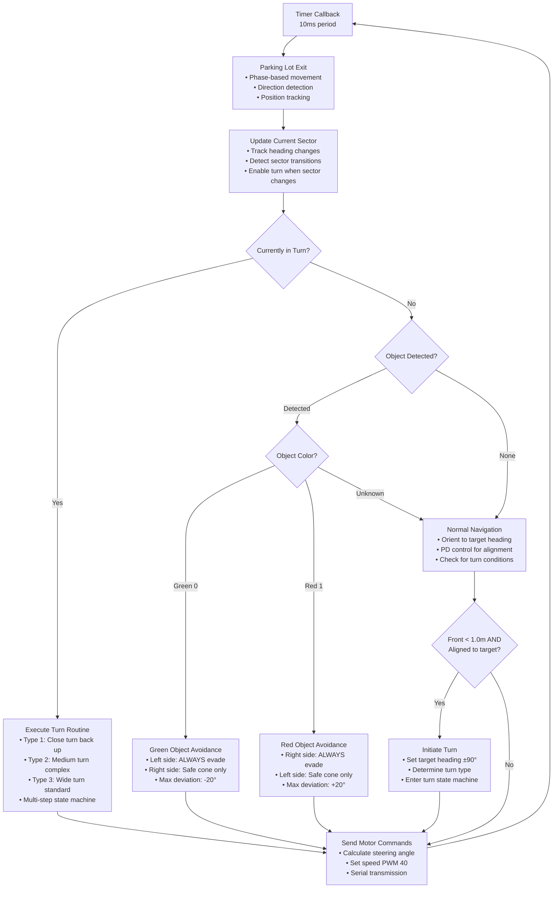

# ChaBots - WRO Future Engineers 2025

<!---->


## Follow us!
  <!-- Facebook -->
  <a href="https://www.facebook.com/chabotsMX/">
    
  </a>
  <!-- Instagram (con degradado real) -->
  <a href="https://www.instagram.com/chabotsmx/" target="_blank">
    
  </a>
  <!-- YouTube -->
  <a href="https://www.youtube.com/@chabotsmx1956/videos" target="_blank">
    
  </a>
  <!-- Página Web (icono de internet) -->
  <a href="https://www.chabots.mx" target="_blank">
    
  </a>

This repository contains the documentation for **ChaBots** participation in the **WRO Future Engineers 2025** category. Our robot was designed and built by a Mexican students team,  passionate about robotics and education.


## 📜 Table of Contents

1. 🧑‍💻 [The Team](#the-team)
2. 🎯 [The Challenge](#the-challenge)
3. 💭 [Discussion](#discussion)
4. 🤖 [Robot Overview](#robot-overview)
5. 🔋 [Sense Overview](#sense-overview)
6. ⚙️ [Mobility Management](#mobility-management)
7. 💡 [Electronics](#electronics)
8. 💻 [Code Overview](#code-overview)
9. 🚧 [Obstacle Management](#obstacle-management)
10. 🛠️ [Construction Guide](#construction-guide)
11. 💰 [Cost Report](#cost-report)
12. 📚 [Resources](#resources)
13. ©️ [License](#license)
---

## 1. The Team <a name="the-team"></a>
<div align="center">

</div>
<div align="center">
    <h2 style="color:#1e90ff; font-size:2.2em; margin-top:0.5em; margin-bottom:0.2em;">
        <span style="color:#222; background:linear-gradient(90deg,#1e90ff,#00c3ff,#00ffb3,#1e90ff);-webkit-background-clip:text;-webkit-text-fill-color:transparent;">We are <b>ChaBots NERV</b></span> -[:]
    </h2>
</div>

### Roy Iván Barrón Martínez
**Age:** 20\
**Role:** Captain, Electronics & Software Designer

I am a self-taught robotics enthusiast with experience in embedded systems, software, and mechanical integration. my team ChaBots Ocelot won Mexico Robocup soccer Open second place and achieved multiple national awards in programming and robotics.

> "I enjoy setting nearly impossible goals to push myself while learning. I believe that learning should always lead to building something real."

---

### Leonardo Villegas Lopez
**Age:** 20\
**Role:** Mechanical Designer

I am a Mechatronics Engineering student passionate about technology and innovation. I have been a contestant for eight years, winning various regional and national competitions, and participating internationally.
> "I will take any opportunity to grow"

---

### Hiram Jalil Castillo Gutierrez
**Age:** 22\
**Role:** Software Developer

I am a Software Engineer student and I love robotics and programming. I have been a contestant for 8 years, from regional to national competitions, I have participated in 4 Mexico Robocup Soccer and 1 MakeX Robotics Competition, top 3(2019) and runner-up(2019).

> "Anyway, robotics is my passion and I will never forget it."

---

### Diego Vitales Medellín
**Age:** 22\
**Role:** Coach

I've been involved in robotics for 14+ years being a programmer for most of the projects I've taken part in. I've had may regional, national and international experiences. Now I'm working in sharing my knowledge with more people to push further their level and potential as well as helping them achieve their goals and find their passion.

> "I like to face challenges and even more so when it's with more people. Learning and creating something is better when shared."

---

## 2. The Challenge <a name="the-challenge"></a>

The **WRO Future Engineers** challenge pushes students to create fully autonomous self-driving vehicles. Each robot must:

- Navigate a dynamically randomized track
- Detect and avoid colored obstacles (green/red blocks)
- Execute a parallel parking maneuver

Scoring is based on:
- Performance on track
- Obstacle handling
- Documentation quality
- Innovation and engineering rigor

For more indo visit: [WRO Official Site](https://wro-association.org/)

---

## 3. Discussion <a name="discussion"></a>

### 3.1. Decisions

Throughout this project, we faced numerous critical decisions that shaped our robot's final design. Our approach was driven by the principle of creating a robust, reliable system capable of handling the unpredictable nature of autonomous navigation challenges.

#### Why This Architecture?

We chose a **distributed ROS2 architecture** for several key reasons:

1. **Modularity**: Each sensor and algorithm runs in isolated nodes, making development, testing, and debugging significantly more manageable
2. **Scalability**: Adding new sensors or algorithms requires minimal changes to existing code
3. **Real-time Performance**: ROS2's real-time capabilities ensure consistent timing across all systems

#### Hardware Selection Rationale

**RPLiDAR C1**: Despite being expensive, the 360° scanning capability proved essential for complete environmental awareness. Alternative sensors like ultrasonic arrays couldn't provide the same level of detail and accuracy.

**OTOS Sensor**: The optical tracking approach was chosen over traditional wheel encoders due to its immunity to wheel slip and superior accuracy in dynamic environments.

**Raspberry Pi 5**: The increased computational power over previous generations allowed us to run complex computer vision algorithms in real-time while maintaining ROS2 communication overhead.

### 3.2. Regional Experience and Lessons Learned

Our experience at the regional competition was... challenging, to put it mildly. **We didn't perform as expected**, our robot's performance was disappointing during those crucial moments.

#### What Went Wrong at Regionals

- **Sensor calibration issues** under competition lighting conditions

The regional result was a wake-up call that forced us to completely re-evaluate our approach.

### 3.3. Rebuilding the System

**We invested approximately 500 hours** into completely rebuilding and refining every aspect of our system:

#### What We Rebuilt

**Complete Software Stack**:
- Migrated from basic control loops to PID controllers with adaptive parameters
- Implemented sensor fusion algorithms for robust state estimation
- Developed multi-modal obstacle avoidance strategies
- Created comprehensive safety systems with multiple fallback mechanisms

**Hardware Redesign**:
- Switched from 3D-printed chassis to carbon fiber for improved rigidity
- Upgraded to precision steel shafts and custom gearboxes
- Implemented proper electromagnetic interference shielding
- Redesigned cable management for reliability

**Testing Infrastructure**:
- Built a complete testing environment that simulates competition conditions
- Developed automated testing scripts for regression testing
- Created comprehensive calibration procedures

### 3.4. Technical Achievements

#### Algorithm Innovation

Our **sensor fusion approach** combines OTOS, LiDAR, and vision data using Kalman filtering techniques that provide centimeter-level accuracy in dynamic environments.

The **adaptive control system** automatically adjusts PID parameters based on track geometry, allowing optimal performance in both tight corners and wide corridors.

#### Real-time Performance

Achieving **10Hz control loop frequency** while processing:
- 360° LiDAR scans at 8Hz
- Computer vision at 30fps
- OTOS updates at 100Hz
- Safety monitoring at 100Hz

#### Robustness Features

- **Multi-sensor validation** prevents single points of failure
- **Graceful degradation** when sensors malfunction
- **Emergency stop systems** with sub-20ms response times
- **Automatic recovery** from most common failure modes

### 3.5. Competition Strategy Evolution

Our approach to the WRO Future Engineers challenge evolved significantly:

**Initial Strategy (Regional)**: Focus on basic navigation with simple obstacle avoidance
**Current Strategy (National/International)**: Comprehensive autonomous system with advanced AI-driven decision making

#### Key Strategic Insights

1. **Reliability over Speed**: Consistent completion beats occasional fast times
2. **Sensor Redundancy**: Multiple sensors for the same measurement prevent catastrophic failures
3. **Adaptive Algorithms**: One-size-fits-all approaches don't work in dynamic environments
4. **Extensive Testing**: Simulated conditions must exceed competition difficulty

---

## 4. Robot Overview <a name="robot-overview"></a>

 **Name:** Eva

<table style="width: 100%;">
  <tbody>
    <tr>
      <td>
        <center><h4>Front</h4></center>
        
      </td>
      <td>
        <center><h4>Back</h4></center>
        
      </td>
    </tr>
    <tr>
      <td>
        <center><h4>Left</h4></center>
        
      </td>
      <td>
        <center><h4>Right</h4></center>
        
      </td>
    </tr>
  </tbody>
</table>

---

## 5. Sense Overview <a name="sense-overview"></a>

### 5.1. RPLiDAR C1
360° laser scanner for environmental mapping and obstacle detection.
<div>
  
</div>

**Tech specs:**
- 360° scanning with 0.9° resolution
- Up to 8m range with 10Hz update rate
- Quality filtering for reliable data
- ROS2 integration via `rplidar_ros` package

**Link:** [RPLiDAR C1](https://www.slamtec.com/en/C1)

### 5.2. Raspberry Pi Camera V3
High-resolution camera for color object detection.

<div>
  
</div>

**Tech specs:**
- 12MP IMX708 Quad Bayer sensor and features a High Dynamic Range mode
- Supports 1080p30, 720p60, and VGA90 video modes

**Link:** [Raspberry Pi Camera V3](https://www.raspberrypi.com/products/camera-module-3/)

### 5.3. SparkFun Optical Tracking Odometry Sensor
High-precision odometry sensor for accurate position tracking.

<div>
  
</div>

**Tech specs:**
- Measures linear and angular displacement
- High-resolution optical flow sensor
- ROS2 integration via custom `otos_reader` node

**Link:** [SparkFun OTOS](https://www.sparkfun.com/sparkfun-optical-tracking-odometry-sensor-paa5160e1-qwiic.html)

---

## 6. Mobility Management <a name="mobility-management"></a>

### 6.1. Gearbox:

The robot's transmission features a custom-designed gearbox, with the base and gears developed in CAD software and manufactured in-house. For fabrication, the team used a Creality K2 Plus Combo printer, chosen for its reliability in handling engineering-grade materials. The material selected was Polymaker PETG-CF (a carbon-fiber-infused PETG), prized for its high stiffness, dimensional stability, and excellent wear resistance, which are critical for durable mechanical components.
A key design feature is the use of double helical gears. This geometry was chosen over standard spur gears to ensure smoother, quieter power transmission with reduced vibration and superior load distribution. This significantly improves mechanical efficiency and component lifespan.
The drive axle consists of 4 mm steel shafts, which were custom-cut from rod stock. To ensure positive torque transfer from the gearbox to the wheels, the ends of the shafts were manually modified using a Dremel tool to create a "D" shape. This profile prevents slippage between the shaft and the wheel hub, a common failure point in high-torque applications.

| Part | Description | Image |
| --- | --- | --- |
| 6.1.1. Maxon DCX19 | The powerhouse for the gearbox is the Maxon DCX19, a 19 mm brushed DC motor equipped with an integrated planetary gearhead. This motor was selected for its high power density, precision, and proven reliability. The integrated gearhead is the primary source of torque multiplication, providing a final output speed of 600 RPM. This combination delivers the high torque and controlled speed necessary to meet the robot's performance requirements for acceleration and payload handling. | <picture style="display: block; margin: 0 auto;"></picture> |
| 6.1.2. Base | We designed the base of the gearbox so that the wheel axle is as close as possible to the steering axis in order to make tighter turns. | <picture style="display: block; margin: 0 auto;"></picture> |
| 6.1.3. Gears | The custom-printed double helical gears transfer power from the motor's gearhead output to the wheel axle. This external gear stage was designed with a 1:1 gear ratio. This configuration was chosen because the Maxon motor's integrated gearhead already provided the ideal speed reduction (down to 600 RPM) and torque multiplication. The 1:1 external gears, therefore, act as a direct power transmission, simplifying the design while perfectly matching the motor's output speed to the drive wheels. | <picture style="display: block; margin: 0 auto;"></picture> |
| 6.1.4. Wheels | The rear wheel hubs (rims) were also custom-designed and 3D-printed to integrate perfectly with the transmission. The central feature of the hub is a D-shaped bore (hole). This profile is precisely matched to the D-shaped 4 mm steel shafts, ensuring a secure, non-slip mechanical lock. This method guarantees that all torque generated by the motor is effectively transferred from the axle directly to the wheel. | <picture style="display: block; margin: 0 auto;"></picture> |

### 6.2. Steering System

For the steering system, the goal was to simplify the mechanism as much as possible, as this would allow for quick and easy manufacturing. However, we decided to make this an Ackermann system, allowing the inner wheel to have a larger angle than the outer wheel. Thanks to this, we were able to prevent the front wheels from slipping when turning, something that occurred with the previous non-Ackermann model.

| Part | Description | Image |
| --- | --- | :---: |
| 6.2.1. Servo HiTEC HS-85MG | We selected the HiTEC HS-85MG for our robot's Ackermann steering system, primarily due to its robust metal gears (MG). Unlike many standard or smaller servos that use plastic gears, the metal gearing provides the significantly enhanced durability and resistance to stripping that our steering mechanism requires. This is crucial for us to handle the mechanical loads, vibrations, and potential impacts inherent in the system's operation. We also find that this servo packs considerable torque and good precision into a compact "mighty mini" form factor, supported by a top ball bearing. This ensures it provides the strength we need to turn the wheels effectively while maintaining accurate steering angles, minimizing the excessive "slop" or backlash we might see in less robust options. For application, this blend of power, durability, and reliable accuracy in a small package makes it a superior choice over servos that could fail or wear quickly under the demands of steering. |  |
| 6.2.2. Base | We designed the base around the servo, so that everything was symmetrical. We also designed the base to be modular and easily attach to the robot's chassis for easy repairs. We 3D printed the base using carbon fiber filament, as we did all the other robot parts, to increase strength. |  |
| 6.2.3.1. Servo Connector | We designed the servo connector this way because, as an Ackermann system, the wheels needed to be connected independently of each other. If we used a single connector for the wheels, both would have the same turning angle, but by splitting it, each wheel would turn at a different angle. |  |
| 6.2.3.2. Wheel Connectors | As mentioned above, we used two connectors, one per wheel, so they rotated independently. These connectors aren't straight, as this shape allows us to more clearly define the angle differences between the wheels. However, we arrived at this shape experimentally, as if the shape were more pronounced, we reached a point where the wheel wouldn't return to its original position. |  |
| 6.2.4. Wheel Supports | We designed the L-shaped wheel mount so that the wheels could rotate more easily and not collide with the robot's chassis. |  |
| 6.2.5. Wheels | We decided to make our own wheels because we couldn't find any commercial wheels that fit our robot. We previously used the Lego Spike wheels, but they had very little contact surface area, so we decided to create our own wheels using the measurements of Spike's wheels. To do this, we created a rim and 3D printed it. We then used a mold and polyurethane resin to make the rubber. This process is shown in the following video: [WRO FutureEngineers Custom Wheels - chaBots NERV](https://youtu.be/8JH6QCOU_B0) |  |

### 6.3. Bases

| Part | Description | Image |
| --- | --- | :---: |
| 6.3.1. Lidar Base | The base for the lidar was designed in the simplest way possible, with eight holes, four for screwing the lidar in and the rest for fixing the base. |  |
| 6.3.2. Camera Base | The camera mount is a copy-paste of the lidar mount, modified to support the camera. We experimentally set the angle of this mount to give the camera the widest possible field of view without it looking outside the track. |  |
| 6.3.3. Chasis | The chassis is the robot's main structure, as all other systems are mounted on it. A modular design was chosen to facilitate assembly and maintenance. The chassis is made of carbon fiber, which was cut in China. |  |

### 6.4. Assembly


The steering system is mounted on the chassis using 20mm-high M3 posts. The odometer PCB is anchored below the steering system, as this makes better use of space. The gearbox is mounted directly to the rear of the chassis, and the Raspberry Pi 5 is mounted on it using 20mm-high M2.5 posts. The main PCB is mounted in the middle, and the Lidar base is mounted on 20mm-high M3 posts. The Raspberry Pi camera v2 base is mounted on the Lidar base using 40mm-high M3 posts. Using these poles helped us keep the robot as low as possible, allowing the Lidar sensor to be leveled with the runway walls.

<table style="width: 100%;">
  <tbody>
    <tr>
      <td></td>
      <td></td>
    </tr>
    <tr>
      <td></td>
      <td></td>
    </tr>
    <tr>
      <td></td>
      <td></td>
    </tr>
  </tbody>
</table>

---

## 8. Electronics <a name="electronics"></a>

All of the electronics in our robot are designed to be as fast and reliable as possible. This led us to use higher‑end components and a clear division of responsibilities between processors. For instance, it is not a good idea to use a Raspberry Pi 5 directly to control a servo and a DC motor—the OS and user processes introduce latency and consume CPU time. To address this, we use a dedicated microcontroller for time‑critical I/O and control loops: the *Teensy 4.0*.

Before choosing, we considered both performance and the strict space constraints of our mechanical design. Everything must fit within our allotted envelope without compromising serviceability.

## Microcontroller comparison


|MCU  |Clock speed |  Observed PWM behavior*
|--|--|--|
| Teensy 4.0 | 600 MHz |Excellent|
|Arduino Nano|16 MHz|Good|
|Raspberry Pi Pico|133 MHz|Inconsistent at low duty|


*Notes on PWM behavior: Using the same nominal PWM frequency across all three MCUs, we observed different motor responses. On the Teensy 4.0, the motor starts smoothly and can deliver more torque at lower duty cycles. The Raspberry Pi Pico struggled at very low speeds and required careful tuning. The Arduino Nano behaved as expected for an AVR‑based board. We could not find definitive documentation explaining these differences; our working theory is that PWM implementation details (SDK, drivers, timer resolution, and library quality) play a role. Teensy and Arduino platforms are primarily C/C++ with mature vendor‑maintained timer libraries, while typical Pico workflows often lean on MicroPython or community libraries, which may trade convenience for timing granularity.

## Power architecture

-   *Main battery:* 3S (11.1 V) *LiPo, ~2200 mAh*.

-   *Regulation:* Pololu *D42V55F5* step‑down regulator (5 V, up to 6 A) feeding the Raspberry Pi 5 and the servo.

-   *Isolation:* The Teensy 4.0 is powered from an *isolated supply* to protect it from motor/EMI transients; all other subsystems draw from the main rail via appropriate regulators and filtering.


## Motor driver

We use the *VNH7070AS* full‑bridge driver. It comfortably handles the required current (≈8 A continuous in our use case) and supports supply voltages above 20 V, providing generous headroom. Because there is no widely available off‑the‑shelf module for this device, we integrated it directly onto our PCB. This raises the bar for assembly, but the result is more reliable and, in practice, more cost‑effective.

## PCB design

Our PCB uses *6 layers*:
|Layer  |Type  |
|--|--|
| 1 |Signal  |
|2|GND
|3|Signal
|4|Signal
|5|GND
|6|GND

This stack‑up, combined with stitching vias, short return paths, and careful placement, yielded a robust, fully integrated board with *low EMI emissions. Despite having the motor as close as **5 cm* to sensitive wiring, we can communicate at high baud rates reliably.

<table style="width: 100%; table-layout: fixed;">
  <tr>
    <td>
   The main PCB controls the motors and the servo. It includes a built-in full-bridge motor driver (VNH7070ASTR), an XT60 connector for direct battery input, and protection against overcurrent, overvoltage, surges, and reverse polarity. It also provides UART connections between the Teensy 4.0 and Raspberry Pi 5, plus a header for the servo pins.
    </td>
    <td>
      
    </td>
  </tr>
  <tr>
    <td>
The odometry PCB provides a better mounting solution for our OTOS sensor. Because the sensor doesn’t have space for JST headers, this board serves as an intermediate adapter and offers a secure mechanical mount.
    </td>
    <td>
      
    </td>
  </tr>
  <tr>
    <td>
The Raspberry Pi PCB is designed as a HAT. It offers a more robust way to manage connections than using loose DuPont leads: you can solder jumper wires to it, making the setup more reliable than DuPont jumpers alone.
    </td>
    <td>
      
    </td>
  </tr>
</table>

---

*Summary:* Separating real‑time control (Teensy 4.0) from high‑level compute (Raspberry Pi 5), providing clean power (isolated Teensy rail + regulated 5 V), and integrating an automotive‑grade driver (VNH7070AS) on a 6‑layer PCB gives us the responsiveness and robustness demanded by the challenge.

## Schematic details

Our PCB design is implemented across three specialized boards to maximize reliability and minimize electromagnetic interference:

### Schematic Overview

<table style="width: 100%; table-layout: fixed;">
  <tr>
    <td>
      <h4>Main PCB</h4>
      
      <p style="font-size: 0.9em; margin-top: 0.5em;">Primary power distribution, motor driver (VNH7070AS), and system control.</p>
    </td>
  </tr>
  <tr>
    <td>
      <h4>Odometry PCB</h4>
      
      <p style="font-size: 0.9em; margin-top: 0.5em;">OTOS sensor mount and signal conditioning.</p>
    </td>
  </tr>
  <tr>
    <td>
      <h4>Raspberry Pi HAT</h4>
      
      <p style="font-size: 0.9em; margin-top: 0.5em;">Robust I/O connections and UART bridge for Pi.</p>
    </td>
  </tr>
</table>

### 1) Battery input & primary protection

-   *Connector:* XT30 (U14/U19) for main power.

-   *Transient suppression:* TVS diodes on the input and 5 V rails (e.g., *SMBJ18* class at the battery side and *SMAJ5.0CA* on the 5 V rail) clamp surges from motor commutation and cable hot‑plugging.

-   *Input filtering:* Bulk electrolytic (≈*470 µF) plus local ceramics (100 nF*) provide low‑ and high‑frequency decoupling. Keep the electrolytic close to the power switch/step‑down input and sprinkle 100 nF near every IC supply pin.

-   *(Recommended)* Add a resettable fuse (polyfuse) sized for your continuous draw and an ideal‑diode OR high‑side FET for reverse‑polarity protection if you expect frequent battery swaps.


### 2) Latching power switch (high‑side)

-   *Function:* A soft‑latching high‑side switch drives a low‑RDS(on) P‑channel MOSFET (*TPH1R712MDL*) to connect/disconnect the main rail.

-   *Control:* A momentary/toggle switch (*SW3*) biases a small driver network (Q3 + resistors) that pulls the MOSFET’s gate. The RC on the gate provides gentle inrush and reduces connector arcing.

-   *Why high‑side:* Keeps grounds common and only switches the positive rail, avoiding ground‑bounce issues with USB/UART connections to the PC.


### 3) 5 V regulation rail (Raspberry Pi + servo)

-   *Module:* Pololu *D42V55F5* (5 V @ up to 6 A). Place it so that current from the battery flows battery → switch → regulator → loads.

-   *Post‑filtering:* An *LC section* (e.g., *L1 = 22 µH, **C9 ≈ 470 µF, plus **100 nF* ceramics) reduces switching ripple seen by the Pi and the servo.

-   *Surge/ESD:* A *SMAJ5.0CA* across the 5 V rail provides additional protection. Keep diode and bulk cap leads short and wide.

-   *Grounding:* Return the regulator ground straight to the *GND plane* and keep the high‑di/dt loop (switch → inductor → diode/cap → switch) as tight as possible.


### 4) Teensy 4.0 section

-   *Role:* Real‑time control (PWM generation, sensor timing, safety interlocks). The Pi handles high‑level logic/vision.

-   *Supply isolation:* The Teensy is fed from a *clean/isolated input* to protect it from motor noise. Decouple 3.3 V with multiple *0.1 µF* and a *10 µF* bulk close to VIN/3V3.

-   *I/O mapping:* Dedicated pins for *PWM* to the motor driver and for *servo. A **UART header (H3)* exposes *TX/RX/GND* for diagnostics.

-   *Signal integrity:* If runs exceed ~10–15 cm, add *33–100 Ω* series resistors on digital lines (IN1/IN2/PWM) to damp edges and reduce ringing into the VNH driver.


### 5) Motor driver stage (VNH7070AS)

-   *Device:*  *VNH7070AS* integrated H‑bridge; internal MOSFETs handle current spikes and integrate flyback paths.

-   *Interface:* Pins *INA/INB/PWM/EN/CS* (nomenclature varies per package) connect to the Teensy. Keep logic ground common with power ground at a single low‑impedance point.

-   *Decoupling:* Place *≥ 470 µF* bulk right at *VCC* of the driver and multiple *100 nF* ceramics. Add an input *TVS (SMBJ18 class)* across motor supply near the driver.

-   *Snubbing:* For very noisy motors, an *RC snubber* (e.g., 100 nF + 1–2 Ω, tuned empirically) across the motor terminals can reduce EMI. Keep motor leads twisted and short.

-   *Thermal:* Provide a solid copper pour under the thermal pad with many *thermal vias* to GND to spread heat to inner planes.


### 6) Connectors & peripherals

-   *Servo header:* Powered from the regulated 5 V rail; keep return path next to the 5 V trace.

-   *Battery sense / telemetry (optional):* If you expose the pack to the MCU, use a *divider* + *RC* and consider *TVS/small **series resistor* to protect the ADC.

-   *NeoPixel header (P1):* Decouple with *100 nF* at the connector and, if long strips are used, a *large electrolytic* (≥1000 µF) at the first LED.


### 7) Layout guidance (applied)

-   *Stack‑up:* 6‑layer with *three GND planes* (L2/L5/L6) provides low impedance return and shields signals.

-   *Star power:* Route battery → switch → regulator → loads with *star‑like branching*; do not daisy‑chain sensitive logic behind motor currents.

-   *Keep loops tight:* Especially the driver’s *switching loop* and the regulator loop. Use wide pours for battery and motor paths.

-   *Segregate zones:* Physically separate *power* (battery, driver, regulator) from *logic* (Teensy, level‑signals). Cross at right angles if they must cross.

-   *Stitching vias:* Surround the driver and the high‑current paths with plenty of GND stitching vias to contain fields and lower EMI (already used here).


### 8) Bring‑up & test checklist

1.  Power the board with a *current‑limited bench supply* (e.g., 0.5–1 A) and verify no abnormal draw.

2.  Measure *5 V* rail at the Pi and servo connector under light load.

3.  With the motor disconnected, toggle the power switch—check gate voltage of the high‑side MOSFET for clean transitions.

4.  Connect a small DC motor and run *10–20% PWM; scope **VCC* and *GND* near the driver for spikes.

5.  Increase load gradually; verify the driver’s *thermal pad* stays below spec and that bulk caps do not heat.

6.  Verify UART debug works; confirm CS/FAULT lines (if used) change as expected under stall or overcurrent tests.

----------
## 7. Code Overview <a name="code-overview"></a>

This is an autonomous robot developed with ROS2 using Python. The robot can navigate autonomously, detect obstacles, and detect colored objects. We decided on using ROS2 since it allows us to develop the different features of our robot modularly, which also makes each component and feature more manageable.

### 7.1. System Architecture Diagram



### 7.2. Implementations

#### 7.2.1. Kinetic Obstacle Detection and Hardware Communication
- **File**: `src/teensy_communication/launch/robot.launch.py`
- **Function**: Process sensor data and send the desired direction of the Ackermann and the speed of the motors.
- **Features**:
  - Teensy configuration
  - Odometry and sensor management

#### 7.2.2. Computer Vision
- **File**: `src/vision_node/vision_node/color_detection_node.py`
- **Function**: Green, red, and purple object detection
- **Features**:
  - HSV filtering for specific colors
  - Distance and angle calculation
  - Noise filtering

#### 7.2.3. Localization System (OTOS)
- **File**: `src/otos_reader/otos_reader/otos_node.py`
- **Function**: Provides precise odometry using OTOS sensor
- **Features**:
  - Software bias correction
  - EMA filtering for smoothing
  - ZUPT detection (Zero Velocity Update)
  - Odometry and TF transforms publishing  - Distance and angle calculation

### 7.3. Data Flow

```
┌──────────┐     ┌─────────────┐     ┌──────────────┐
│ Sensors  │────▶│ ROS2 Nodes  │────▶│ Control     │
│          │     │             │     │ Algorithms   │
│ • OTOS   │     │ • otos_node │     │              │
│ • LiDAR  │     │ • rplidar   │     │ ┌──────────┐ │
│ • Camera │     │ • vision    │     │ │ Decision │ │
│ • IMU    │     │ • teensy    │     │ │ Making   │ │
└──────────┘     └─────────────┘     │ └──────────┘ │
                                     └──────┬───────┘
                                            │
┌──────────────┐     ┌─────────────┐       	│
│   Actuators  │◀────│ Commands    │◀──────┘
│              │     │             │
│ • Motors     │     │ /cmd_vel    │
│ • Servo      │     │ /motor_cmd  │
│              │     │ /servo_cmd  │
└──────────────┘     └─────────────┘
```

### 7.4. Implemented Algorithms

#### 7.4.1. Navigation
Using RPLIDAR C1 Ros2 package we can read the topic from our own node,
```c++
void on_scan(const sensor_msgs::msg::LaserScan::SharedPtr msg)
{
    const float angle_min = msg->angle_min;
    const float angle_inc = msg->angle_increment;
    const float pi = static_cast<float>(M_PI);
    lidarMSG.clear();
    for (size_t i = 0; i < msg->ranges.size(); ++i)
    {
        const float ang = angle_min + angle_inc * static_cast<float>(i);
        if (ang < -0.5235f && ang > -2.6180f || ang > pi)
            continue; // 0..180°
        const float r = msg->ranges[i];
        if (!std::isfinite(r) || r < msg->range_min || r > msg->range_max)
            continue;
        lidarMSG.push_back({ang, pointAngX(ang, r), pointAngY(ang, r), r});
    }
}
```
This callback is called only when a the lidar node post a new message in topic, this module only stores a cloud of points sent by the lidar, the next step is procces this information to get the actual position of the robot in the track, we use the OTOS to update this information every call, because of the lidar only posting at 10hz is to slow, it means it only have new information every 100ms that make imposible to have a smoth move, the OTOS post at 100Hz, meaning we can smoth our trajectory 10 times more using this, we dont use absolute infromation like coordinates in x or y axis, we take the changue in cm betwen the new read and the last read and add it to the cloud of points, also we calculate some infromation to help our robot to not colide with the walls, like the distance in front, left and rigth, this help to calculate optimal PD controller values relative to robots position and speed.
```c++

void getOffsetsFromLidar()
{
    if (new_otos_data.load())
    {
        const float yaw_prev = deg2rad(lastYaw.load());
        const float dx_w = posX_.load() - lastPosX.load();
        const float dy_w = posY_.load() - lastPosY.load();
        const float dth = wrapPi(deg2rad(yaw.load() - lastYaw.load()));
        const float c0 = std::cos(yaw_prev), s0 = std::sin(yaw_prev);
        const float dx_b = c0 * dx_w + s0 * dy_w;
        const float dy_b = -s0 * dx_w + c0 * dy_w;
        const float c = std::cos(-dth), s = std::sin(-dth);

        for (auto &spt : lidarMSG)
        {
            float x = spt.x - dx_b;
            float y = spt.y - dy_b;
            float xr = c * x - s * y;
            float yr = s * x + c * y;
            spt.x = xr;
            spt.y = yr;
            spt.angle = wrapPi(std::atan2(yr, xr));
            spt.mag = std::hypot(xr, yr);
        }
        lastPosX.store(posX_.load());
        lastPosY.store(posY_.load());
        lastYaw.store(yaw.load());
        new_otos_data.store(false);
    }

    float rightDis = 0;
    float leftDis = 0;
    float frontDis = 0;
    int sum_left = 0;
    int sum_right = 0;
    int sum_front = 0;
    float totalDis = 0;
    float setpoint = 0;
    const float phi = (90.0f - absolute_angle.load()) * static_cast<float>(M_PI) / 180.0f;

    float sumX = 0, sumY = 0;
    for (const auto &s : lidarMSG)
    {
        const float ang = s.angle;
        const float ang_eff = ang + phi; // MISMA rotación para todos
        sumX += s.x;
        sumY += s.y;
        if (ang_eff >= 0.0f && ang_eff < 0.78f)
        { // izquierda ~ 0..45°
            leftDis += s.mag * std::cos(ang_eff - 0.0f);
            ++sum_left;
        }
        if (ang_eff > 2.35f && ang_eff <= static_cast<float>(M_PI))
        { // derecha ~ 135..180°
            rightDis += s.mag * std::cos(ang_eff - static_cast<float>(M_PI));

            ++sum_right;
        }
        if (ang_eff >= 1.39f && ang_eff <= 1.74f)
        { // frente ~ 80..100°
            frontDis += s.mag * std::cos(ang_eff - M_PI_2);
            ++sum_front;
        }
    }
    absolute_angle.store(rad2deg(std::atan2(sumY, sumX)));
    leftDis /= sum_left;
    rightDis /= sum_right;
    frontDis /= sum_front;
    totalDis = std::fabs(leftDis) + std::fabs(rightDis);
    anchoCorredor.store(totalDis);
    setpoint = totalDis / 2.0f;
    frontWallDistance.store(frontDis);
    centeringOffset.store(setpoint - std::fabs(rightDis));
}

```

Talking about optimal values, we have a simple track map function to be able to reach max speed in every type of turn, becasue the track isnt symetric, it can struggle with the same valiue if the wall is closer, fo example at 60 cm instead of the standar 100 cm, this function also let us now in what turn it is and know when to stop and to get the drive direction too.

```c++
void getActualSector()
{
    float orientation = heading360.load();
    int thisSector = actualSector.load();
    int thisSectorUpperLimit = sectoresAngs[0][thisSector];
    int thisSectorLowerLimit = sectoresAngs[1][thisSector];

    if (thisSector == 0)
    {
        orientation >= 180 ? orientation -= 360 : orientation = orientation;
        if (orientation < -75)
        {
            actualSector.store(3);
            inTurn.store(false);
            if (driveDirection.load() == 0)
            {
                driveDirection.store(2);
            }
        }
        else if (orientation > 75)
        {
            actualSector.store(1);
            inTurn.store(false);
            if (driveDirection.load() == 0)
            {
                driveDirection.store(1);
            }
        }
    }
    else if (static_cast<int>(orientation) > thisSectorUpperLimit + 30)
    {
        thisSector++;
        inTurn.store(false);
        thisSector > 3 ? thisSector = 0 : thisSector = thisSector;
        actualSector.store(thisSector);
    }
    else if (static_cast<int>(orientation) < thisSectorLowerLimit - 30)
    {
        thisSector--;
        inTurn.store(false);
        thisSector < 0 ? thisSector = 3 : thisSector = thisSector;
        actualSector.store(thisSector);
    }
}

```
#### 7.4.2. Obstacle Avoidance

The obstacle avoidance system (`teensy_obs_node.cpp`) implements a multi-sensor approach for autonomous navigation in environments with colored obstacles. This system integrates LIDAR, odometry, and computer vision to provide intelligent obstacle detection and avoidance capabilities.

#### Overview

The obstacle avoidance node operates as a state machine with three primary operational modes:
- **Normal Navigation**: Wall-following behavior with sector-based movement
- **Obstacle Avoidance**: Color-based object detection and avoidance maneuvers
- **Turn Execution**: Multi-step turning algorithms for corner navigation

##### Vision Integration
```cpp
// Vision system subscribers
object_distance_sub_ = create_subscription<std_msgs::msg::Float32>("/object/distance", 10, ...);
object_angle_sub_ = create_subscription<std_msgs::msg::Float32>("/object/angle", 10, ...);
object_color_sub_ = create_subscription<std_msgs::msg::Float32>("/object/color", 10, ...);
object_status_sub_ = create_subscription<std_msgs::msg::Float32>("/object/status", 10, ...);
```

The system subscribes to vision node outputs providing:
- **Distance**: Object distance in centimeters
- **Angle**: Relative angle to object in degrees
- **Color**: Object classification (0 = green, 1 = red)
- **Status**: Detection status (0 = no object, 1 = object detected)

#### Sensor Processing
The node processes LIDAR data to extract directional distance measurements:
```cpp
// LIDAR sector analysis
if(a < -1.3962f && a > -1.7453f) { sumBack += r; ++totalBack; }      // Back sector
if (a > 1.39 && a < 1.7453f) { sumFront += r; ++totalFront; }        // Front sector
if( a > 0.0f && a < 0.5235f) { sumLeft += r; ++totalLeft; }          // Left sector
if( a > 2.79252f && a < 3.141592f) { sumRight += r; ++totalRight; }  // Right sector
```

### Obstacle Avoidance Algorithm
#### Color-Based Avoidance Strategy

**Green Obstacle Avoidance:**
```cpp
if(color == 0){ // Green obstacle
    angle = angle - 20;  // Bias left by 20 degrees
    if(angle < 0){
        float returnANG = 90 + angle;
        // Steer away from green obstacle
        mover(returnANG, 50, 0);
    }
}
```

**Red Obstacle Avoidance:**
```cpp
else if(color == 1){ // Red obstacle
    angle = angle + 20;  // Bias right by 20 degrees
    if(angle > 0){
        float returnANG = 90 + angle;
        // Steer away from red obstacle
        mover(returnANG, 50, 0);
    }
}
```

#### Decision Making Logic
The main control loop implements a hierarchical decision structure:

```cpp
void on_timer() {
    getActualSector();  // Update sector tracking
    int isObs = object_status_.load();

    if(inturn.load()){
        rutinaGirar();  // Execute turn routine
        return;
    }
    else if(isObs == 1){
        // Object detected - execute avoidance
        executeObstacleAvoidance();
    }
    else{
        // Normal navigation
        orientar();  // Maintain heading
        checkTurnConditions();
    }
}
```
#### Adaptive Turning System
The system implements three distinct turning algorithms based on available space:
##### Turn Type Classification
```cpp
if(outWallDistance >= 0.8f){
    turntype_.store(3);  // Wide turn - standard maneuver
}
else if(outWallDistance < 0.8f && outWallDistance >= 0.3f){
    turntype_.store(2);  // Medium turn - complex multi-step
}
else if(outWallDistance < 0.3f){
    turntype_.store(1);  // Close turn - backup required
}
```

##### Turn Execution State Machine

**Type 1 - Close Turn (Backup Required):**
1. **Step 0**: Align to target heading
2. **Step 1**: Reverse until sufficient clearance (`distBack < 0.5m`)

**Type 2 - Medium Turn (Complex Maneuver):**
1. **Step 0**: Approach corner with 45° offset
2. **Step 1**: Reverse turn with heading correction
3. **Step 2**: Complete turn in reverse

**Type 3 - Wide Turn (Standard):**
1. **Step 0**: Forward approach until close to wall
2. **Step 1**: Execute directional turn (150° left / 30° right)
3. **Step 2**: Complete turn in reverse

#### Performance Characteristics

##### Real-Time Operation
- **Control Frequency**: 100 Hz (10ms cycle time)
- **Serial Communication**: 2 Mbps UART with checksum validation
- **Thread Safety**: Atomic variables for all shared state

##### Sensor Integration Timing
- **LIDAR Processing**: Real-time sector analysis
- **Vision Integration**: Object detection at 30 FPS
- **Odometry Fusion**: 100 Hz pose updates

#### Navigation Parameters
```cpp
// Fixed speed for obstacle round
const int OBSTACLE_SPEED = 50;  // PWM value

// Distance thresholds
const float TURN_THRESHOLD = 1.0f;      // Front distance to initiate turn
const float ALIGNMENT_TOLERANCE = 5.0f; // Heading error tolerance (degrees)
const float CLOSE_DISTANCE = 0.3f;      // Close turn threshold
const float WIDE_DISTANCE = 0.8f;       // Wide turn threshold
```

### Safety Systems

##### Collision Prevention
- Continuous front distance monitoring
- Emergency stop capability
- Multi-sensor validation before maneuvers

##### State Validation
- Finite state machine prevents invalid transitions
- Atomic operations ensure thread-safe state updates
- Timeout mechanisms for stuck conditions

##### Error Recovery
- Automatic retry for failed turn sequences
- Fallback to normal navigation if vision system fails
- Robust serial communication with error detection

##### Vision-LIDAR Fusion

The system combines vision and LIDAR data for enhanced obstacle detection:

1. **Vision System**: Provides precise object classification and angular position
2. **LIDAR System**: Validates distances and provides environmental context
3. **Fusion Logic**: Cross-validates detections and selects optimal avoidance strategy

This multi-modal approach ensures robust performance in complex environments with varying lighting conditions and obstacle configurations.

##### Integration with WRO Future Engineers Challenge

The implementation aligns with the WRO Future Engineers challenge requirements by enabling autonomous navigation, obstacle detection, and avoidance in a dynamic environment. The system's modular design allows for easy adaptation to different track layouts and obstacle placements, ensuring compliance with competition rules.

### 7.4.3. Sample Solution Implementations

#### Open Round Control (teensy_comm_node) - Detailed Flow Diagram



##### Open Round Implementation Details

**Motion Compensation** (getOffsetsFromLidar):
- Extracts yaw delta from OTOS quaternion
- Transforms LIDAR points using rotation matrices:
  - `x_robot = cos(yaw_prev) * dx_world + sin(yaw_prev) * dy_world`
  - `y_robot = -sin(yaw_prev) * dx_world + cos(yaw_prev) * dy_world`
- Updates absolute angle as centroid of transformed points: `atan2(sumY, sumX)`

**Sector Detection** (getActualSector):
```cpp
Hysteresis: ±30° bounds before sector transition
Sector 0 (0°): if heading < -75° or > 75°
Sector 1 (90°): if heading 15° to 165°
Sector 2 (180°): if heading 105° to 255°
Sector 3 (270°): if heading 195° to 345°
driveDirection: 1=clockwise, 2=counter-clockwise
```

**Corridor Analysis** (getOffsetsFromLidar segment):
```cpp
Front sector: 80-100° → frontDis (meters)
Left sector: 0-45° → leftDis (meters)
Right sector: 135-180° → rightDis (meters)
centeringOffset = (rightDis - leftDis) / 2.0
anchoCorredor = leftDis + rightDis (total width)
```

**Parameter Optimization** (getOptimalValues):
| Current Width | Next Width | optimalSpeed | optimalKp | optimalSpeedTurn | optimalKpTurn |
|---|---|---|---|---|---|
| ≥0.80m | ≥0.80m | 5.0 m/s | 0.20 | 4.0 m/s | 0.30 |
| ≥0.80m | <0.80m | 1.0 m/s | 0.50 | 1.8 m/s | 0.60 |
| <0.80m | ≥0.80m | 1.7 m/s | 0.50 | 1.7 m/s | 0.75 |
| <0.80m | <0.80m | 3.0 m/s | 0.50 | 1.5 m/s | 0.60 |

**Speed Control** (controlACDA):
```cpp
// PD-based speed adjustment
error = targetSpeed - actualSpeed
aproxPwm = [35 PWM if <0.6, 40 if <1.2, 60 if >1.2]
pwm = (error * 8.25) + ((error - lastError) / 0.01) * 0.1
pwm = clamp(aproxPwm + pwm, lastPwm ± 10, 0-255)
```

**Angle Processing** (angleProccesing):
```cpp
angularError = 90° - absolute_angle
steeringAngle = 30 * tanh(angularError / 40)  // nonlinear response
// Maintains servo smoothness, prevents jerky oscillations
```

**Speed Reduction by Angle** (objectiveAngleVelPD):
```cpp
// Reduces speed proportional to centering error
e = 90° - absolute_angle  // wrapped to [-180, 180]
derivada = EMA(de/dt, alpha=0.3)  // filtered derivative
reduction = 0.04 * |e| + 0.005 * |derivada|
return clamp(reduction, vel_min=0.0, vel_max=0.5)
```

**Serial Command Format** (empaquetar):
```
[0xAB] [angle_high] [angle_low] [pwm] [direction] [xor_checksum]
angle = uint16 in tenths of degrees (0-3600 = 0-360°)
pwm = uint8 (0-255)
direction = 0 (forward), 1 (reverse)
checksum = XOR of all preceding bytes
```

---

#### Obstacle Round Control (teensy_obs_node) - Detailed Flow Diagram



##### Obstacle Round Implementation Details

**Parking Lot Exit** (outOfParkingLot):
```cpp
Phase 1: Detect direction
  - left_wall < right_wall → direction = 1 (left)
  - right_wall < left_wall → direction = 2 (right)

Phase 2: Forward drive until Y < 0.03m

Phase 3: Set servo angle
  - direction 1 → servo = 150° (left)
  - direction 2 → servo = 50° (right)
  - wait 1000ms for mechanical settling

Phase 4: Reverse movement
  - direction 1 → reverse until Y < -0.04m
  - direction 2 → reverse until Y < -0.05m

Phase 5: Forward again until Y > 0.15m

Phase 6: Center servo (90°), exit parking phase
```

**LIDAR Segmentation** (on_scan):
```cpp
Front sector: 80-100° (1.39-1.745 rad)
Left sector: 0-30° (0-0.524 rad)
Right sector: 160-180° (2.79-3.14 rad)
Back sector: -135° to -100° (-2.356 to -1.745 rad)

Each region averaged: dist_front_, dist_Left_, dist_Right_, dist_back_
absolute_angle = atan2(sumY, sumX) * 180/π
```

**Turn Type Selection** (determineTurnType):
```cpp
outWallDistance = distance to wall on turning side

if (outWallDistance < 0.30m):
    TYPE = 1  // Close turn - requires backup

else if (0.30m ≤ outWallDistance < 0.70m):
    TYPE = 2  // Medium turn - complex maneuver

else (outWallDistance >= 0.70m):
    TYPE = 3  // Wide turn - standard rotation
```

**Turn Execution** (rutinaGirar):

**Type 1 (Close Turn)**:
```cpp
Step 0: Orient toward target heading (Kp = 1.0)
        servo = 90 + (targetYaw - currentYaw) * 1.0
        pwm = 40 (forward)

Step 1: Reverse until back_wall < 0.5m
        servo = 90 + (targetYaw - currentYaw)
        pwm = 0 (reverse)

Exits when: back_wall distance reached AND heading aligned
```

**Type 2 (Medium Turn)**:
```cpp
Step 0: Forward at 90° until front < 0.7m
        servo = 90, pwm = 40

Step 1: Angle-correct toward (targetYaw - 45°)
        servo = 90 + correction, pwm = 40

Step 2: Reverse diagonal approach
        servo = (targetYaw - 45°), pwm = 0

Step 3: Final centering in reverse
        servo = targetYaw, pwm = 0

Completes when: position settled + heading aligned
```

**Type 3 (Wide Turn)**:
```cpp
Step 0: Slow forward at 90° until front < 0.3m
        servo = 90, pwm = 30 (slow)

Step 1: Sharp rotate to turn angle
        servo = 150° (left) or 50° (right), pwm = 40
        wait 2s for rotation completion

Step 2: Reverse to center line
        servo = targetYaw, pwm = 0

Exits when: centered and aligned to target heading
```

**Obstacle Avoidance Logic**:

**GREEN Object (priority left)**:
```cpp
distance_range = [30cm, 100cm]
prop = (maxDis - distance) / range  // proximity weight

if (object_angle < -30°):  // Left side
    ALWAYS evade: offset = -OffSetmax * prop

else if (-30° ≤ object_angle ≤ 30°):  // Centered
    Safe cone: w_phi = cos²(angle / 30°)
    offset = -OffSetmax * w_phi * prop

else:  // Right side (object_angle > 30°)
    Only evade if in safe cone

servo_target = 90 + offset
Smoothing: max 3°/tick change
```

**RED Object (priority right)**:
```cpp
// Inverse logic of green
if (object_angle > 30°):   // Right side
    ALWAYS evade: offset = +OffSetmax * prop

else if (-30° ≤ object_angle ≤ 30°):
    Safe cone: w_phi = cos²(angle / 30°)
    offset = +OffSetmax * w_phi * prop

else:  // Left side
    Only evade if in safe cone

servo_target = 90 + offset
Smoothing: max 3°/tick change
```

**Sector Navigation** (orientar):
```cpp
Target heading by sector:
Sector 0 → targetYaw = 0°
Sector 1 → targetYaw = 90°
Sector 2 → targetYaw = 180°
Sector 3 → targetYaw = 270°

Heading control:
error = wrap_to_180(targetYaw - currentYaw)
servo = 90 + (error * 1.0)  // Simple proportional
servo = clamp(servo, 40°, 160°)
```

#### Performance Comparison

| Metric | Open Round | Obstacle Round |
|--------|-----------|-----------------|
| Control Loop Rate | 100 Hz (10ms) | 100 Hz (10ms) |
| Typical Speed | 60-80 PWM | 40 PWM (fixed) |
| Speed Range | 1-5 m/s | 0-3 m/s + parking |
| Turn Time | ~2-3 seconds | ~3-5 seconds |
| Corridor Following Accuracy | ±5cm centering | ±10cm (avoidance) |
| Maximum Steering Angle | ±30° | ±20° (avoidance) |
| Decision Points Per Lap | ~8-10 | ~12-15 (variable) |
| First Lap Overhead | ~30 seconds | None (exits parking) |

#### 7.4.4. Color Detection

Using OpenCV to detect green, red, and purple objects in the camera feed. The algorithm filters colors in HSV space, finds contours, and calculates distance and angle based on object size and position.

```python
# HSV filtering for green
mask_green = cv2.inRange(hsv, lower_green, upper_green)

# HSV filtering for red (two ranges)
mask_r1 = cv2.inRange(hsv, lower_red1, upper_red1)
mask_r2 = cv2.inRange(hsv, lower_red2, upper_red2)
mask_red = cv2.bitwise_or(mask_r1, mask_r2)

# HSV filtering for purple
mask_purple = cv2.inRange(hsv, lower_purple, upper_purple)

# Noise filtering
mask_green = cv2.morphologyEx(mask_green, cv2.MORPH_OPEN, kernel)
mask_red = cv2.morphologyEx(mask_red, cv2.MORPH_OPEN, kernel)
mask_purple = cv2.morphologyEx(mask_purple, cv2.MORPH_OPEN, kernel)

# Distance calculation
distance = (KNOWN_WIDTH * FOCAL_LENGTH) / bounding_box_width
```

### 7.5. Control Implementation
Using the sum of every point from the lidar we get a vector that tell us where to go, this for it self isnt optimal cause it tell us where is more space, so we add a vector pointing to the IMU target, this help us to get more smooth and optimal trajectories more than just drive where you can.
```c++
float angleProccesing(float kpNoLinear = 0.75f, float maxOut = 30.0f, bool yawMode = false, float yawKp = 0.025f)
{
    float yawHelpError = wrap_deg180(heading360.load() - sectoresAbsAng[actualSector.load()]) * yawKp;
    if (inTurn.load())
    {
        if (driveDirection.load() == 1)
        { // horario
            yawHelpError = wrap_deg180(heading360.load() - wrap_360(sectoresAbsAng[actualSector.load()] - 90.0f)) * 0.5;
        }
        else if (driveDirection.load() == 2)
        { // antihorario
            yawHelpError = wrap_deg180(heading360.load() - wrap_360(sectoresAbsAng[actualSector.load()] + 90.0f)) * 0.5;
        }
    }
    float angleInput = absolute_angle.load();

    yawMode ? angleInput = angleInput + yawHelpError : angleInput = angleInput;

    float angularError = 90.0f - angleInput;
    float beta = kpNoLinear / maxOut;

    return maxOut * std::tanh(angularError / (maxOut / kpNoLinear));
}


```
With this info now is time to make the robot move to that direction, its not enough with send a simple pwm, because speed have to changue in turns and in corridors, and also is not the same if is in a wide corridor and the next also is, or if its in a wide corridor and the next is narrow, so to go to the max speed we can we use a ACDC controller, this make the robot have the ability to go not only at a constant speed measured in m/s, this make the robot able to activly brake if is needed.
```c++
int controlACDA(float targetSpeed)
{
    float pwm = 0, jerk = 10;
    float error = targetSpeed - speed.load();
    float aproxPwm = 35.0f;

    if (targetSpeed < 0.6f)
    {
        aproxPwm = 35.0f;
    }
    else if (targetSpeed < 1.2f)
    {
        aproxPwm = 40.0f;
    }
    else
    {
        aproxPwm = 60.0f;
    }

    float lastPwmLocal = lastPwm.load();
    float kp = 8.25f; // Valor a determinar
    float kd = 0.1f;  // Valor a determinar

    pwm = (error * kp) + ((error - lastError.load()) / 0.01) * kd;
    pwm = clampf(clampf(pwm + aproxPwm, lastPwmLocal - jerk, lastPwmLocal + jerk), 0, 255);
    lastPwm.store(pwm);
    lastError.store(error);

    if (error < -0.5f || targetSpeed == 0)
        return 0;

    if (error < -0.1f)
        return 1;

    return static_cast<int>(pwm);
}

```
This helps a lot but is not the only controller we have, cause the speed isnt the same if is correctly aligned or if is near to collide with the walls.

```c++
float objectiveAngleVelPD(float vel_min, float vel_max)
{
    const float alpha = 0.3f; // suavizado EMA
    const float dt = 0.01f;   // 10 ms (timer)
    float a = absolute_angle.load();

    if (!std::isfinite(a))
        return vel_min; // sin reducción cuando no hay ángulo

    // Error envuelto a [-180, 180]
    float e = 90.0f - a;

    while (e > 180.0f)
        e -= 360.0f;

    while (e < -180.0f)
        e += 360.0f;

    // Derivada cruda con el error previo

    float e_prev = lastVelErr.load();
    float raw_derivada = (e - e_prev) / dt; // deg/s "amplificado"

    lastVelErr.store(e);

    // EMA correcto: y(k) = y(k-1) + alpha * (x(k) - y(k-1))

    float der_prev = de_f.load();
    float derivada = der_prev + alpha * (raw_derivada - der_prev);

    de_f.store(derivada);

    const float kp = 0.04f;              // m/s por grado
    const float kd = 0.005f;             // m/s por (grado/seg filtrado)

    float reduccion = kp * std::fabs(e); /*+ kd * std::fabs(derivada);*/

    return clampf(reduccion, vel_min, vel_max); // p.ej. [0.0f, 0.8f]
}
```
#### 6.5.1. Navigation Control
For navigation we first map the track, the first lap is made at a lowe speed and we save dara, after this we calculate optimal speed and PD values in every section of the track.
```c++
void getOptimalValues()
{
    float actualSize = getCurrentSectorSize();
    float nextSize = getNextSectorSize();

    if (actualSize >= 0.80f)
    {
        if (nextSize >= 0.80f)
        {
            optimalSpeed.store(5.0f);
            optimalKp.store(0.20f);
            optimalSpeedTurn.store(4.0f);
            optimalKpTurn.store(0.30f);
            yawMult.store(0.125f);
            turnYawMult.store(0.1f);
            turnDis.store(1.2f);
        }

        else if (nextSize < 0.80f)
        {
            optimalSpeed.store(1.0f);
            optimalKp.store(0.50f);
            optimalSpeedTurn.store(1.8f);
            optimalKpTurn.store(0.60f);
            yawMult.store(0.125f);
            turnYawMult.store(0.125f);
            turnDis.store(0.7f);
        }
    }

    else if (actualSize < 0.80f)
    {
        if (nextSize >= 0.80f)
        {
            optimalSpeed.store(1.7f);
            optimalKp.store(0.50f);
            optimalSpeedTurn.store(1.7f);
            optimalKpTurn.store(0.75f);
            yawMult.store(0.125f);
            turnYawMult.store(0.05f);
            turnDis.store(1.0f);
        }

        else if (nextSize < 0.80f)
        {
            optimalSpeed.store(3.0f);
            optimalKp.store(0.50f);
            optimalSpeedTurn.store(1.5f);
            optimalKpTurn.store(0.60f);
            yawMult.store(0.125f);
            turnYawMult.store(0.125f);
            turnDis.store(0.8f);
        }
    }
}
```
### 7.6. System Configuration

#### 7.6.1. Sensors and Calibrations
- **OTOS**: Units in meters and degrees
- **LiDAR**: RPLiDAR C1
- **Camera**: 1280x720, RGB888 format
- **Focal Length**: 1131 pixels

#### 7.6.2. Control Parameters


### 7.7. Robot States

```
┌─────────────┐    ┌─────────────┐     ┌─────────────┐
│  START      │───>│ NAVIGATION  │───> │ DETECTION   │
│             │    │             │     │             │
│ • Calibrate │    │ • Simple    │     │ • Identify  │
│ • Reset     │    │   SLAM      │     │   objects   │
│ • Wait      │    │ • Avoid     │     │ • Calculate │
└─────────────┘    │   obstacles │     │   position  │
                   └─────────────┘     └─────────────┘
                          ^                    |
                          └────────────────────┘
```

### 7.8. ROS2

#### 7.8.1. Topics
| Topic | Type | Description |
|--------|------|-------------|
| `/scan` | LaserScan | LiDAR data |
| `/odom` | Odometry | OTOS odometry |
| `/camera/image_raw` | Image | Camera image |
| `/cmd_vel` | Twist | Velocity commands |
| `/objects/detection` | Float32MultiArray | Detected objects data |
| `/objects/status` | Float32 | Number of detected objects |

#### 7.8.2. ROS2 Diagram


### 7.8.3. Open Source ROS2 Packages

Our system leverages several well-maintained open-source ROS2 packages to provide robust sensor integration and perception capabilities:

#### **RPLiDAR ROS2 Package**
- **Repository:** [rplidar_ros](https://github.com/Slamtec/rplidar_ros)
- **License:** BSD
- **Purpose:** Real-time LiDAR data acquisition and ROS2 integration
- **Version:** Compatible with ROS2 Humble and later
- **Key Features:**
  - Publishes `sensor_msgs/LaserScan` messages at configurable rates (up to 10 Hz)
  - Angle range: 0° to 360° with 0.9° resolution
  - Supports quality filtering to remove unreliable measurements
  - Built-in motor speed control via PWM
  - Configurable output frame ID for multi-robot scenarios

- **Configuration:**
  ```yaml
  rplidar_node:
    ros__parameters:
      serial_port: "/dev/ttyUSB0"
      serial_baudrate: 115200
      frame_id: "lidar_link"
      angle_compensate: true
      scan_mode: "Sensitivity"
  ```

- **Published Topics:**
  - `/scan` (sensor_msgs/LaserScan): Raw laser scan data

- **Subscribed Topics:**
  - None (hardware-only input)

#### **PiCamera2 Integration**
- **Framework:** libcamera (Official Raspberry Pi camera driver)
- **Purpose:** High-performance camera capture for vision processing
- **Version:** Python bindings for libcamera
- **Key Features:**
  - 12MP IMX708 sensor with High Dynamic Range (HDR) support
  - Zero-copy buffer management for minimal latency
  - Configurable ISP (Image Signal Processor) tuning
  - Native support for various formats: RGB888, YUV420, JPEG
  - Automatic exposure and white balance control
  - Frame rates up to 90 FPS (VGA resolution)

- **Configuration:**
  ```python
  from picamera2 import Picamera2

  picam2 = Picamera2()
  config = picam2.create_preview_configuration(
      main={"format": 'RGB888', "size": (1280, 720)},
      camera_properties={"NoiseReductionMode": libcamera.controls.draft.NoiseReductionModeEnum.HighQuality}
  )
  picam2.configure(config)
  ```

- **Custom ROS2 Node:**
  - File: `src/vision_node/vision_node/color_detection_node.py`
  - Publishes `/camera/image_raw` (sensor_msgs/Image)
  - Subscribes to control topics for dynamic parameter adjustment
  - Implements real-time HSV color filtering for obstacle detection

#### **tf2 (Transform Library)**
- **Repository:** [tf2](https://github.com/ros2/geometry2)
- **License:** BSD
- **Purpose:** Coordinate frame management and transforms
- **Key Features:**
  - Manages spatial relationships between robot components
  - Static transforms: camera → lidar → base_link
  - Dynamic transforms: odom → base_link (updated from OTOS)
  - Integration with visualization tools (RViz2)

- **Static Transforms (in launch file):**
  ```python
  static_transform_broadcaster = StaticTransformBroadcasterNode(
      arguments=[
          "lidar_link", "base_link", "0.0", "0.0", "0.15", "0", "0", "0",
          "camera_link", "lidar_link", "0.0", "0.02", "0.04", "-1.57", "0", "0"
      ]
  )
  ```

#### **Custom OTOS ROS2 Package**
- **Purpose:** High-precision odometry from SparkFun OTOS sensor
- **File Location:** `src/otos_reader/`
- **License:** MIT (Custom implementation)
- **Communication:** UART over I2C to Qwiic connector
- **Key Features:**
  - 100 Hz update rate for smooth odometry
  - Publishes `nav_msgs/Odometry` messages
  - Implements ZUPT (Zero Velocity Update) detection for stationary calibration
  - EMA (Exponential Moving Average) filtering for noise reduction
  - Automatic bias correction for long-term accuracy

- **Published Topics:**
  - `/odom` (nav_msgs/Odometry): Position, velocity, and orientation
  - `/tf` (tf2_msgs/TFMessage): Odometry frame transform

- **Parameters:**
  ```python
  self.declare_parameter('port', '/dev/ttyAMA0')  # I2C/Serial port
  self.declare_parameter('calibration_distance', 0.5)  # meters
  self.declare_parameter('ema_alpha', 0.2)  # Smoothing factor
  ```

#### **geometry_msgs and sensor_msgs**
- **Repository:** [common_interfaces](https://github.com/ros2/common_interfaces)
- **License:** Apache 2.0
- **Purpose:** Standard message definitions for interoperability
- **Used Message Types:**
  - `sensor_msgs/LaserScan`: LiDAR point cloud (polar format)
  - `sensor_msgs/Image`: Camera frames
  - `nav_msgs/Odometry`: Pose and velocity information
  - `geometry_msgs/Twist`: Velocity commands (linear/angular)
  - `std_msgs/Float32`: Scalar values (distances, angles)

#### **Standard ROS2 Lifecycle**
- **Repository:** [lifecycle](https://github.com/ros2/rcl_interfaces)
- **License:** Apache 2.0
- **Purpose:** Node lifecycle management
- **Implemented States:**
  - `unconfigured`: Node initialized but not ready
  - `inactive`: Configured but not running
  - `active`: Processing sensor data
  - `finalized`: Cleanup on shutdown

#### **Dependency Installation**

To set up all ROS2 dependencies:

```bash
# Install system packages
sudo apt-get install -y \
    ros-humble-sensor-msgs \
    ros-humble-geometry-msgs \
    ros-humble-nav-msgs \
    ros-humble-std-msgs \
    ros-humble-tf2 \
    ros-humble-tf2-geometry-msgs

# Clone and build custom packages
cd ~/ros2_ws/src
git clone https://github.com/Slamtec/rplidar_ros.git -b ros2
git clone https://github.com/chaBotsMX/chaBots-NERV-WRO-Future-Engineers-2025.git

cd ~/ros2_ws
rosdep install --from-paths src --ignore-src -r -y
colcon build --symlink-install
```

#### **Package Maintenance and Contributions**

- **RPLiDAR ROS2:** Actively maintained by Slamtec. Issues and PRs welcome.
- **geometry2/tf2:** Core ROS2 package, part of official distribution
- **Standard Messages:** Part of ROS2 core infrastructure
- **OTOS Custom Package:** Maintained within our repository with regular calibration updates


### 7.9. Execution Commands

```bash
# Launch complete robot
ros2 launch teensy_communication robot.launch.py

# Object detection only
ros2 run vision_node color_detection_node

# OTOS odometry only
ros2 run otos_reader otos_node
```

### 7.10. File Structure

```
src/
├── vision_node/           # Color object detection
│   └── color_detection_node.py
├── otos_reader/          # OTOS odometry
│   └── otos_node.py
└── teensy_communication/ # General coordination
    └── launch/
        └── robot.launch.py
    └── src/
        ├── teensy_comm_node.cpp
        ├── teensy_obs_node.cpp

```

### 7.11. Monitoring and Debug

- **Foxglove Studio**: Real-time visualization
- **RViz**: Trajectories and laser maps
- **OpenCV Windows**: Camera view with detections
- **ROS2 Logs**: Debug information via console

---

## 8. Obstacle Management <a name="obstacle-management"></a>

The robot detects and reacts to obstacles in real-time using multiple sensor modalities:

### 8.1. Detection Methods
- **Primary:** Enhanced color detection via PiCamera2 system
- **Verification:** LIDAR distance measurements for obstacle confirmation and navigation
- **Backup:** OTOS position tracking for navigation consistency

### 8.2. Response Algorithms
- **Dynamic turning decision system** based on cube color and position
- **Follow-the-object mode** with PID steering based on cube centroid
- **Multi-sensor verification** to reduce false positives
- **Adaptive speed control** based on obstacle proximity

---

## 9. Construction Guide <a name="construction-guide"></a>

**Models file folder:** `models/`

### 9.1. Steps
- Step 1: 3D designing
- Step 2: 3D printing
- Step 3: Electronic layout
- Step 4: Wiring
- Step 5: Mounting
- Step 6: Programming
- Step 7: Testing

### 9.2. Construction Tools
- 3D Printer (Creality K2 Plus, QIDI Q1 Pro)
- Polymaker PTG CF filament
- Mini Electric Soldering Iron Kit TS101
- Dremel Tool
- Screwdriver Set Fanttik


## 10. Cost Report <a name="cost-report"></a>

| Item                         | Qty | Unit Cost (MXN) | Total (MXN) |
|------------------------------|-----|------------------|-------------|
| Teensy 4.0                   | 1   | $800              | 800         |
| Raspberry Pi 5                | 1   | $2,800             | $2,800        |
| RPlidar C1                    | 1   | $2,500             | $2,500        |
| Raspberry Pi Camera 12mp V3   | 1   | $920              | $920         |
| Raspberry Pi 5 Camera Cable   | 1   | $64               | $64          |
| 2.2Ah LiPo 11.1V Battery     | 1   | $600              | $600         |
| 1Ah LiPo 3.3V Battery     | 1   | $70               | $70          |
| Maxon Motor DCX19            | 1   | $8,500             | $8,500        |
| HS85MG Micro Servo            | 1   | $2,000             | $2,000        |
| SparkFun OTOS                 | 1   | $2,400             | $2,400        |
| POLYMAKER PLA Filament (prototypes)    | 1kg   | $900        | $900         |
| POLYMAKER PLA-CF Filament (finals)     | 0.5kg   | $450       | $450         |
| Carbon Fiber                  | 1   | $2,000             | $2,000        |
| SMD Components & Misc.   | -   |         $1,500      | $1,500        |
| PCB Manufacturing             | 1   | $800              | $800         |
| Spike Wheels (LEGO)         | 4   | $150              | $600         |
| EV3 Wheels (LEGO)          | 2   | $10              | $20         |
| **Total**                     |     |                  | **$26,924**|


---

## Resources <a name="resources"></a>

- [Chabots Main Site](https://www.chabots.mx)
- [WRO Future Engineers Rules PDF](https://wro-association.org/wp-content/uploads/WRO-2024-Future-Engineers-Self-Driving-Cars-General-Rules.pdf)
- [GitHub Repos](https://github.com/chaBotsMX/chaBots-NERV-WRO-Future-Engineers-2025)

---

## License <a name="license"></a>

```
MIT License
Permission is hereby granted, free of charge, to any person obtaining a copy of this software.
```

---

> *Document maintained by Chabots | Last updated: Sept 2025*

<!--stackedit_data:
eyJoaXN0b3J5IjpbMTcyMzM3ODYxNCwtMzc2NTM2MDM5LDM1ND
c4NDQyMCwxMjQ4Mzg0MTM1LC0yODM3NTcxNywtMTMyNzEwNTIy
MywxMjg3Nzk2NjQsLTQ4MTYzMzM4MF19
-->


> Written with [StackEdit](https://stackedit.io/).
